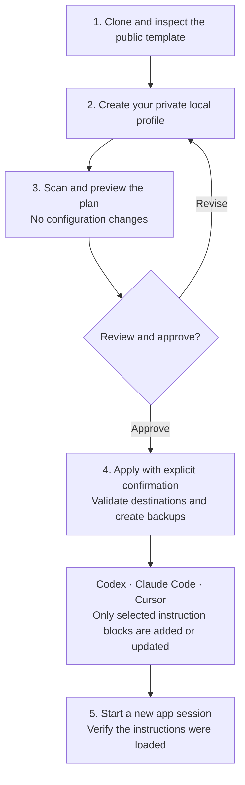

# Safe Team Setup for Codex, Claude Code and Cursor

Version-Timestamp: 2026-09-16 15:43:18 AST

[](https://github.com/newmindsgroup/ide-config-template/actions/workflows/validate-agents.yml)

**One shared working standard. Three coding environments. A setup each teammate controls.**

[Quick start](#start-here) · [Setup flow](#how-it-works) · [App destinations](#what-changes) · [Recovery](#preservation-and-recovery) · [Skills and privacy](#skills-and-privacy)

A public, standard-library Python template for adding portable working instructions to a new or existing AI coding setup. Plan first, review the exact destination list, then apply explicitly.

**Existing settings, credentials, MCP connections, installed skills and model selectors are not changed.** The wizard adds one marked instruction block. It does not install applications, plugins, hooks or models, or activate paid services.

## At a glance

| 🧭 Purpose | 👥 Who it helps | 📦 What you get |
|---|---|---|
| Give AI coding tools consistent instructions for planning, privacy, validation and handoffs. | Teammates setting up a new computer or improving an existing coding environment. | A reviewed setup plan, app-specific instruction blocks, backups and optional skill recommendations. |

## How it works



**In plain language:** clone → personalize → preview → approve → apply → verify. Your profile and recovery copies stay on your computer. Skill recommendations require a separate review and installation.

### What the setup touches

| ✍️ Adds or updates | 🔒 Leaves in place | 🖐️ Requires your action |
|---|---|---|
| This template's marked instruction blocks | Existing text outside those blocks | Approve the plan before applying |
| Local profile, plan and recovery copies | App settings, credentials and MCP connections | Verify instructions in a new app session |
| Manual web-instruction drafts | Installed skills and model selectors | Review optional skills and copy web instructions |

## Start here

Requires Git and Python 3.10 or newer. Clone into a normal source directory, never an application's configuration folder.

```bash
git clone https://github.com/newmindsgroup/ide-config-template.git
cd ide-config-template
cp profile.example.json profile.local.json
```

Edit `profile.local.json` for your role, selected apps and actual subscription access. Use generic goals, not customer information or secrets. This local filename is ignored by Git. Model availability is your declaration, not a live account check.

```bash
python3 scripts/ide-setup.py --scan
python3 scripts/ide-setup.py --plan --non-interactive --profile profile.local.json --workspace /absolute/path/to/project
```

Review the recommendations and `planned_files`. Use the **same profile and workspace** when applying:

```bash
python3 scripts/ide-setup.py --apply --confirm --non-interactive --profile profile.local.json --workspace /absolute/path/to/project
```

Omit `--workspace` for both commands if you do not want a Cursor project rule. On Windows, use `py` or `python` and an absolute Windows project path. Copy the example with PowerShell `Copy-Item` instead of `cp` if needed.

Prefer the saved-profile workflow above. Running `--plan` and `--apply` without a profile starts two separate interviews. An interactive apply does not consume an earlier plan.

## What changes

| Selected app | Destination | Behavior |
|---|---|---|
| Codex | `~/.codex/AGENTS.md` | Adds or replaces only this template's marked block. |
| Claude Code | `~/.claude/CLAUDE.md` | Adds or replaces only this template's marked block. |
| Cursor with workspace | `<workspace>/.cursor/rules/ide-config-template.mdc` | Creates a rule, or updates its existing managed block. Refuses an unmanaged file with that name. |
| Cursor without workspace | `~/.ide-config/manual/cursor-user-rules.md` | Produces instructions for manual review and copying. |
| Optional Antigravity | `~/.gemini/GEMINI.md` | Generates a marked instruction block when selected. Verify support in your app version. |
| Local outputs | `~/.ide-config/` | Profile, recommendation plan, manual web instructions and private backup records. |

Claude Code instructions apply to its coding environment, including supported desktop coding sessions. They do not configure general Claude chat, Cowork, or the web account. ChatGPT and Claude web instructions require manual review and copying.

These adapters use default user-home locations. Custom `CODEX_HOME`, `CLAUDE_CONFIG_DIR`, remote hosts, containers and organization-managed paths require manual adaptation. Project instructions, organization policies and app precedence can override global instructions. Start a new session and check which instructions the app loaded.

Native references: [Codex AGENTS.md](https://developers.openai.com/codex/guides/agents-md/), [Claude Code memory](https://code.claude.com/docs/en/memory), [Cursor rules](https://cursor.com/docs/context/rules).

## Preservation and recovery

- Plan and apply validate all selected destinations before writing. Malformed or duplicate markers, linked files, hard-linked files and special files are refused. User-created symlink ancestors are refused; standard macOS root aliases are resolved.
- Existing content outside the managed block is preserved byte for byte, including line endings and whitespace. A repeated apply with unchanged inputs does not duplicate blocks.
- Every changed existing file, including generated local outputs, gets a recovery copy. The manifest records original destinations, modes and whether a file was newly created.
- Writes replace individual files atomically. Ordinary write failures trigger rollback of completed writes. Stop concurrent editors during setup. This is not a cross-file power-loss transaction, a sandbox against hostile filesystem races, or a guarantee against conflicting instruction meaning.
- Backup runs use private POSIX permissions where supported. Windows protection follows the user's filesystem ACLs. Keep backups in your private home directory.

Remove this template's blocks, using the original selection and workspace:

```bash
python3 scripts/ide-setup.py --remove-managed-block --confirm --profile ~/.ide-config/profile.local.json --workspace /absolute/path/to/project
```

Removal preserves unrelated instructions and may leave empty files or Cursor frontmatter. It does not uninstall applications or delete skills. See [recovery details](docs/personalized-setup.md#recovery).

## Skills and privacy

[approved-skills.json](approved-skills.json) contains **six optional, public reusable recommendations** from two curated plugin groups. Their source URLs pin a reviewed commit. No skill bodies, company-specific plugins, private workflows or experimental candidates are bundled. Role recommendations are deliberately small; an empty list means there is no approved default for that role here.

The catalog records scoped review, not a promise that every workflow has passed real client use. Before adoption, inspect the pinned instructions and dependencies, license, permissions and data flow. Install separately through the app's supported mechanism only when the task needs them. Do not copy an entire personal configuration or bulk-install the upstream library. Project-specific skills belong in their project repository.

Local profiles, project memory, runtime configuration and common secret files are ignored. Git ignore rules do not sanitize tracked content or history. Contributors must inspect the staged diff before publishing. The public-content check catches a limited set of prohibited paths and credential patterns, not every kind of confidential information.

## Updating safely

Review incoming changes in your source checkout before updating it. Re-run plan and apply with your saved profile. Pulling this repository does not change an app's configuration.

For a separate copy of the portable `AGENTS.md` spine, use the local-source updater:

```bash
python3 scripts/update-spine.py --target /absolute/path/to/AGENTS.md
# After reviewing the preview:
python3 scripts/update-spine.py --target /absolute/path/to/AGENTS.md --apply --confirm
```

It preserves text outside the spine and uses the reviewed source checkout, with no remote download. `update.sh` is an optional Bash wrapper. `bootstrap.sh` only clones to a new source directory and refuses existing destinations. Neither helper is needed for normal setup.

## Validation and limits

```bash
bash scripts/verify.sh
```

Tests cover new and existing setups, exact preservation, Cursor collisions, malformed markers, linked destinations, confirmation, idempotency and simulated write-failure recovery. CI runs Python behavior tests on Ubuntu, macOS and Windows. These tests exercise temporary files, not live app sessions or provider accounts. Native app smoke testing remains part of each team member's setup.

`settings.json` is an inert optional example. Do not replace an existing application's settings with it. There are no automatic execution hooks or default secret-bearing review workflows.

Routing guidance is advisory: it cannot switch a model, verify quotas, prove local model performance or enforce review gates. Windows RAM detection is currently unavailable, so the local-model recommendation defaults to none. Use only models actually available in your app. See [routing guidance](docs/routing-efficiency.md).

## Sharing with your team

Send this repository with the instruction: "Clone and inspect it, create a local profile, show me the plan, and wait for my approval before applying." Never send your private profile, backups, tokens, client records or private configuration repository.

Maintainers: read [CONTRIBUTING.md](CONTRIBUTING.md), [SECURITY.md](SECURITY.md) and [PROVENANCE.md](PROVENANCE.md). License: MIT.
